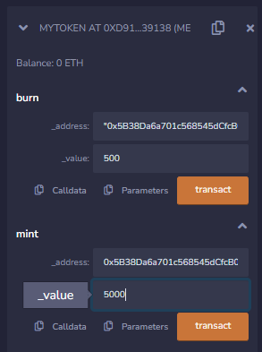

# DETA Token Smart Contract

This is a Solidity smart contract for the DETA token, which includes a token name, token abbreviation, total supply, mapping of addresses to balances, a mint function, and a burn function.

**Requirements**

Public variables that store the details about the coin (Token Name, Token Abbrv., Total Supply)
Mapping of addresses to balances (address => uint)
Mint function that takes two parameters: an address and a value.
Burn function that works the opposite of the mint function, as it will destroy tokens.
Conditionals to make sure the balance of "sender" is greater than or equal to the amount that is supposed to be burned.

**Getting Started**

**To start using the DETA token smart contract, you need to follow these steps:**

Compile the smart contract code using Solidity compiler version 0.8.18 or above.
Deploy the contract to your desired network go to the Remix website at https://remix.ethereum.org/.
Once the contract is deployed, you can start using the mint and burn functions to add or remove tokens from your balance.

**Code Explanation**

-tokenName and tokenAbbrv are public variables that store the name and abbreviation of the token respectively.
-totalSupply is a public variable that stores the total supply of the token.
-balances is a mapping variable that maps an address to its balance of the token.
-mint is a function that takes an address and a value as parameters. 
-It increases the total supply by the value and the balance of the sender's address by the same value.
-burn is a function that takes an address and a value as parameters. 
-It decreases the total supply by the value and the balance of the sender's address by the same value, provided that the sender has a balance greater than or equal to the value.

**Author**
ekodevs